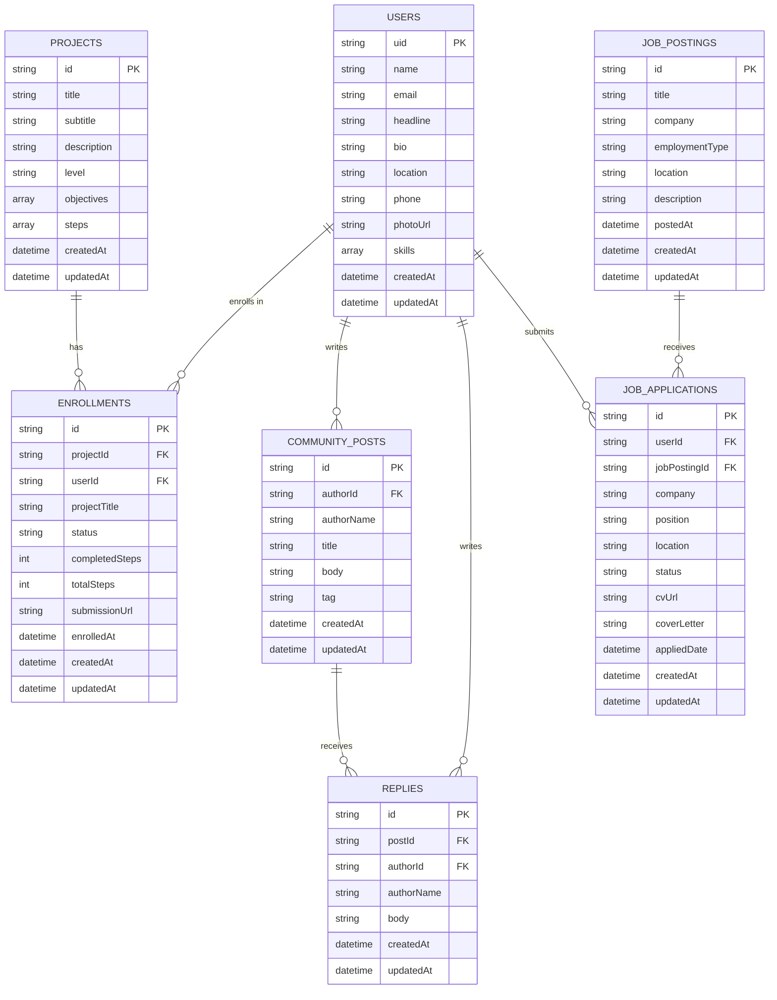

# EmpowerHER ERP Entity Relationship Diagram

Firestore is document-based, so each "entity" below is a top-level collection.
Primary keys are Firestore document IDs; foreign keys are stored as string ID
fields. `users` documents are keyed by the Firebase Auth `uid`.

## Diagram

## Collections (entities)

| Collection | Purpose | Primary key | Foreign keys |
|---|---|---|---|
| `users` | Member profile (auth + profile fields) | `uid` (doc id) | — |
| `projects` | Learning project catalog (seeded) | `id` | — |
| `enrollments` | A user's enrollment/progress in a project | `id` | `userId` → users, `projectId` → projects |
| `community_posts` | Community questions/updates | `id` | `authorId` → users |
| `replies` | Replies on a community post | `id` | `postId` → community_posts, `authorId` → users |
| `job_postings` | Job listings catalog (seeded) | `id` | — |
| `jobs` (job applications) | A user's application to a posting | `id` | `userId` → users, `jobPostingId` → job_postings |

## Relationships

- **User – Project (many-to-many)** resolved through **`enrollments`**: a user
  enrolls in many projects; a project has many enrolled users. Progress
  (`completedSteps` / `totalSteps`, `status`, `submissionUrl`) lives on the
  enrollment.
- **User → Community posts (1-to-many)**: a user authors many posts
  (`authorId`).
- **Community post → Replies (1-to-many)**: a post receives many replies
  (`postId`); each reply is also authored by a user (`authorId`).
- **User – Job posting (many-to-many)** resolved through **`jobs`** (job
  applications): a user applies to many postings; a posting receives many
  applications. Application state (`status`, `cvUrl`, `coverLetter`) lives on
  the application.

## Ownership (drives the Firestore security rules)

| Collection | Owner field | Write access |
|---|---|---|
| `users` | document id (`uid`) | owner only |
| `community_posts` | `authorId` | author only |
| `replies` | `authorId` | author only |
| `jobs` | `userId` | applicant only |
| `enrollments` | `userId` | enrolled user only |
| `projects`, `job_postings` | — (catalog) | read-only for signed-in users |
